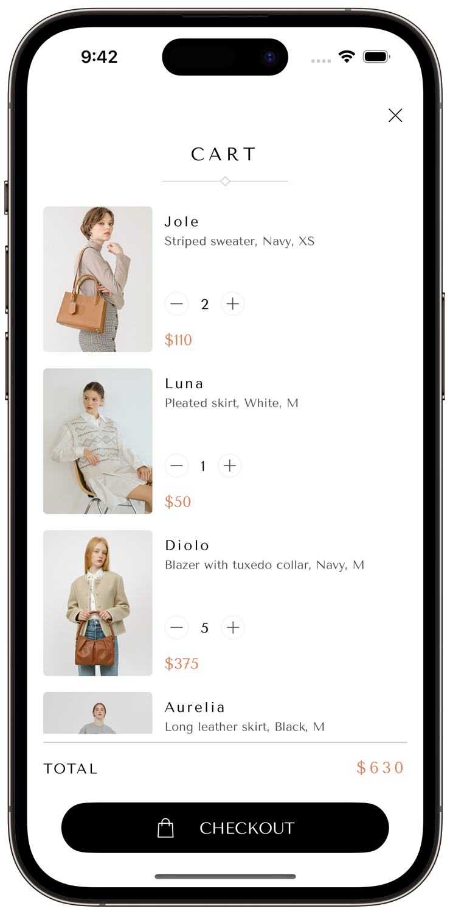
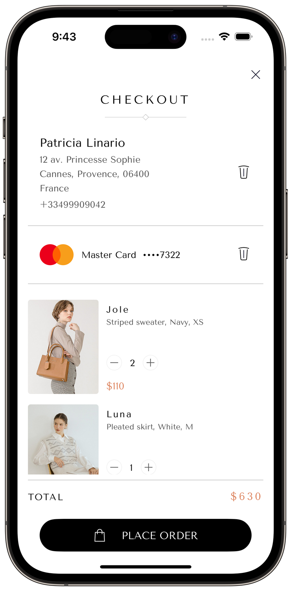

# Fashion Store App
 Fashion Store - pet-project application of an online Fashion Store. Allows users choose products in the online catalog, add them to the cart and make a fake order after adding the delivery address and payment method.

## Architectural pattern
- [x] MVP + Builder + Router

## Frameworks
- [x] SnapKit
- [x] CombineCocoa

## Technologies
- [x] UIKit
- [x] UI fully by code, forced unwrap avoided
- [x] Design from Figma, adapted for rounded screens
- [x] Self-designed JSON-structured database
- [x] Mock Web-server based on GitHub Pages
- [x] Core data service by actor on background queue to store Shopping Cart
- [x] Web service on async/await
- [x] Keychain service with iCloud sync by native API for sensitive data
- [x] Deep link service to open product page in App by link
- [x] Errors service with logging and App-styled popups
- [x] Async/await and Tasks on main and background queues
- [x] Generics in Keychain and Web services
- [x] Collection views based on snapshots with refresh control
- [x] Combine reactive framework for text fields input check
- [x] Typographic font styles with dynamic accessibility font scaling
- [x] Customized animations between screens

## Screenshots
     

**Contacts**  
[LinkedIn](https://www.linkedin.com/in/bytepixelmelody "https://www.linkedin.com/in/bytepixelmelody") | [Telegram](https://t.me/BytePixelMelody "@BytePixelMelody") | [Email](mailto:bytepixelmelody@gmail.com "bytepixelmelody@gmail.com")